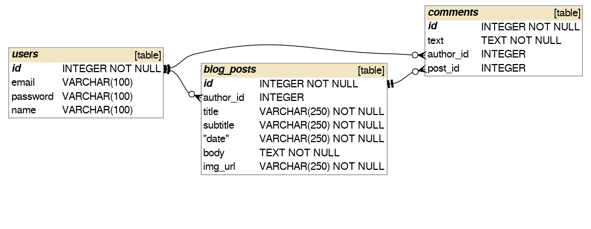

# flask架設部落格  
  
  
Blog link: https://kaka-flask-blog.herokuapp.com/  

## 技術項目  
1. 網頁前端  
	- 繼承Flask-Bootstrap樣板做使用  
	- WTForms建立表單  
	- ckediter搭配WTForms產生文字編輯欄  
	- Gravatar產生使用者頭相  

2. 註冊登入  
	- hash：利用werkzeug對明碼做加密  
	- flask-login管理註冊登入狀態  
	
3. 資料庫  
	- 本地端使用SQLite, 線上使用Postgres  
	- ORM使用SQLAlchemy方便跨資料庫部署  
	
4. 網站保護  
	- 防止sql injection, html injection  
	- @admin_only保護router  

5. 部署  
	- heroku連結github自動部署  
	- wsgi web server 使用gunicorn  

